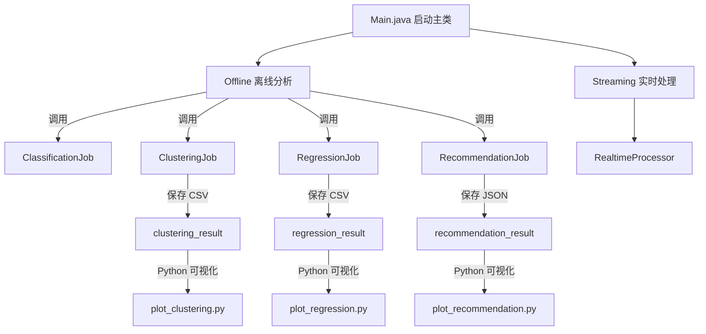
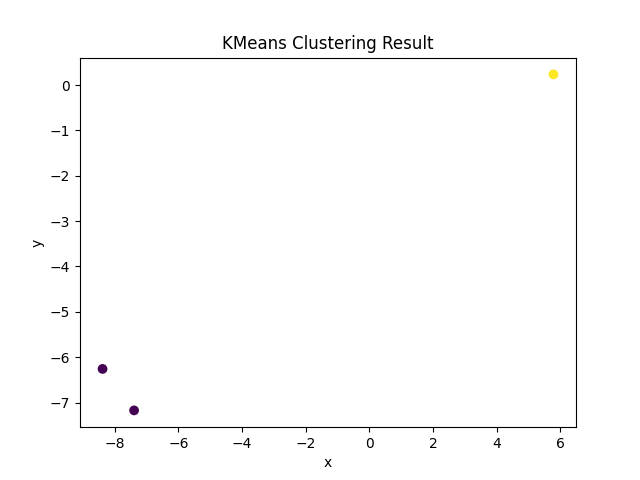
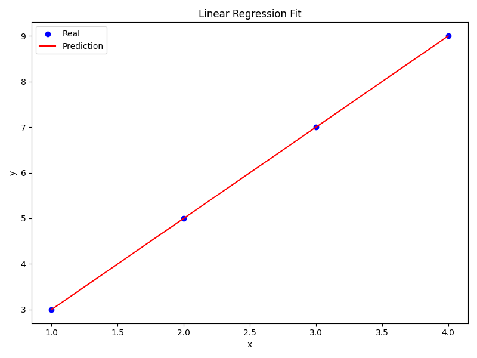
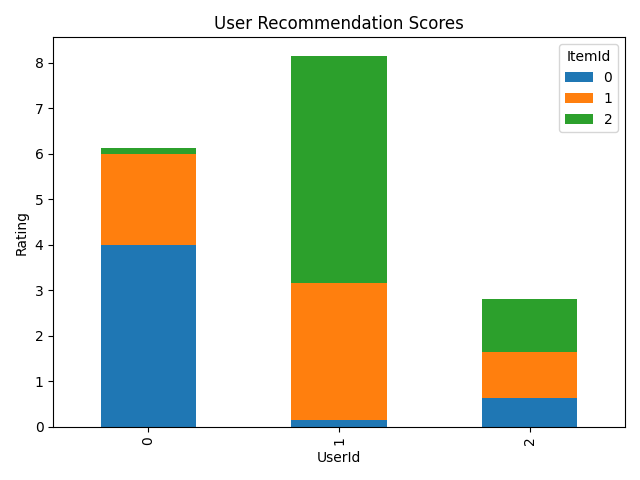

以下是为你的 Spark + Java + Python 可视化混合项目编写的完整 `README.md`，内容涵盖项目结构、设计思路、模块说明和图表辅助。你可以直接放入项目根目录。

---

# 🚀 MLinSpark：基于 Spark 的机器学习平台


---

## 📚 项目简介

本项目是一个使用 **Apache Spark** 构建的通用 **机器学习平台**，支持 **离线分析（Classification / Clustering / Regression）** 和 **实时流处理（Streaming Kafka 数据）**。通过结合 Python 可视化工具，实现了全流程的 **数据分析、模型训练、预测及图形展示**。

---

## 🏗️ 项目结构

```bash
MLinSpark/
├── data/                         # 所有输入数据文件存放目录
│   ├── classification_input.csv
│   ├── clustering_input.csv
│   └── regression_input.csv
├── output/                       # 所有模型结果输出目录
│   ├── clustering_result/
│   ├── regression_result/
│   └── recommendation_result/
├── src/main/java/com/example/mlplatform/
│   ├── Main.java                 # 主入口
│   ├── offline/
│   │   ├── ClassificationJob.java
│   │   ├── ClusteringJob.java
│   │   ├── RegressionJob.java
│   │   └── RecommendationJob.java
│   └── streaming/
│       └── RealtimeProcessor.java
├── visualization/               # Python 可视化脚本
│   ├── plot_clustering.py
│   ├── plot_regression.py
│   └── plot_recommendation.py
├── generate_clustering_data.py  # 生成聚类测试数据
├── pom.xml
└── README.md
```

---

## 💡 项目设计思路



---

## 🔍 各模块说明

### ✅ 离线模块（Offline）

| 模块             | 功能描述                       | 输入文件                            | 输出目录                            |
| -------------- | -------------------------- | ------------------------------- | ------------------------------- |
| Classification | 使用 Spark MLlib 实现分类任务（可拓展） | `data/classification_input.csv` | `output/classification_result/` |
| Clustering     | 使用 KMeans 聚类分析并输出簇划分及可视化图  | `data/clustering_input.csv`     | `output/clustering_result/`     |
| Regression     | 使用线性回归预测数值，并输出真实 vs 预测图    | `data/regression_input.csv`     | `output/regression_result/`     |
| Recommendation | 使用 ALS 协同过滤推荐系统            | 自动生成                            | `output/recommendation_result/` |

### ✅ 实时模块（Streaming）

* 使用 Spark Streaming + Kafka 实时消费并处理消息数据。
* 支持将处理结果动态输出到控制台或存储系统。

---

## 📊 可视化分析（Python）

使用 `matplotlib`、`pandas` 完成输出结果的图表展示，自动保存到 `output/`：

| 文件名                      | 图示内容         |
| ------------------------ | ------------ |
| `plot_clustering.py`     | 聚类二维散点图      |
| `plot_regression.py`     | 真实值与预测值曲线图   |
| `plot_recommendation.py` | 用户推荐打分的柱状堆叠图 |

运行示例：

```bash
python visualization/plot_clustering.py
```

---

## ⚙️ 构建与运行

### 📦 构建项目

```bash
mvn clean package
```

### 🚀 启动主程序

```bash
spark-submit --class com.example.mlplatform.Main target\spark-ml-platform-1.0.jar offline 
```

或选择具体任务：

```bash
spark-submit --class com.example.mlplatform.Main target\spark-ml-platform-1.0.jar offline-recommendation
spark-submit --class com.example.mlplatform.Main target\spark-ml-platform-1.0.jar offline-clustering
```

---

## 📌 依赖说明

### Java 依赖（`pom.xml`）

* Apache Spark 3.5.1
* Kafka Clients 3.5.1
* Maven Shade Plugin

### Python 依赖

```bash
pip install pandas matplotlib
```

---

## 📈 可视化示例图

### Clustering 结果：



### Regression 结果：



### Recommendation 结果：



---

## 🧠 后续扩展建议

* 支持更多模型：决策树、随机森林、XGBoost
* 集成 TensorBoard 或 Spark UI 分析训练过程
* 使用 Flask 或 Spring Boot 构建 Web 可视化前端

---

## 📄 License

本项目基于 MIT License 开源使用。

---


